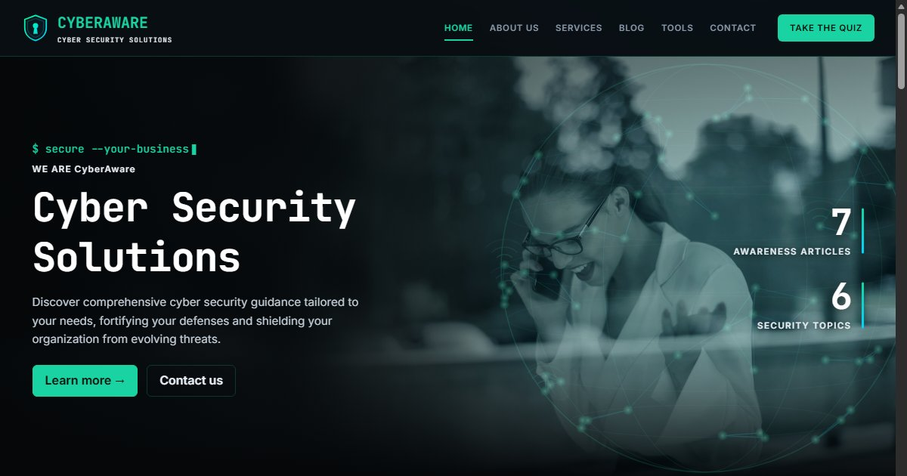

# CyberAware

A responsive cyber security awareness website with animated illustrations, a blog, and an interactive password-strength checker. Built as a portfolio project.

**Live demo:** https://cyberaware-mu.vercel.app/
**Source:** https://github.com/Itz-Naksh/cyberaware



## Features

- Landing page with hero, animated world-network globe and count-up statistics
- Sections: About, Services, Blog, Tools, Checklist, Contact
- Blog with 7 plain-language security articles, category filters and search
- **Phishing quiz**: 5 realistic messages, instant feedback and a score
- **Password-strength checker** that runs fully in the browser (nothing is sent or stored)
- Animated SVG illustration for every topic, scroll-reveal effects, reading-progress bar
- Contact form (Formspree-ready), full footer, sticky nav with active-section highlight and a mobile hamburger menu
- Responsive layout for phones, tablets and desktops, plus link-preview (Open Graph) tags
- Respects the "reduce motion" accessibility setting

## Tech stack

React 19 · React Router (hash routing) · Vite · plain CSS · inline SVG. It is a fully static site with no backend.

## Run it locally

```bash
npm install
npm run dev      # open the http://localhost:5173/ link it prints
```

Build for production with `npm run build` (output goes to `dist/`) and preview it with `npm run preview`.

## Customise

- Name, email, phone, location and social links: `src/site.js`
- Articles: `src/articles.js`
- Hero photo: `src/assets/hero-photo.jpg`

## Credits

Hero photo by Olly on [Pexels](https://www.pexels.com/photo/3855605/) (free to use under the Pexels license).

## Deploy

Push to GitHub, then import the repository on [Vercel](https://vercel.com). It detects Vite automatically.
